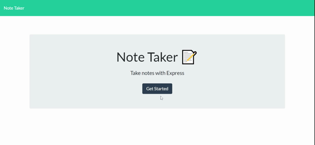

# Note Taker 

## Table of Contents
* [Description](#description)
    * [Deployed Application](#deployed-application)
* [Installation](#installation)
* [Usage](#usage)
* [License](#license)
* [Contributing](#contributing)
* [Tests](#tests)
* [Questions](#questions)
    
## Description
This project is the eleventh homework assignment of the UW Coding Bootcamp. For this project I was asked to create an application that would store notes in a database. The application needed the ability to get, post, and delete notes. This application utilized the Express npm package and deployed to a dynamic port. 

### Deployed Application

## Installation
To install necessary dependencies, run the following command: npm i

## Usage
To use this project: <ol>
<li>Clone the repository: "git@github.com:aubrey-heim/Employee-Summary.git"</li>
<li>Install the dependencies using “npm i”</li>
<li>Run the application using “npm start”</li>
<li>Navigate to “http://localhost:3001</li>
</ol>

## License
This repository has a MIT license. For more information on this license, please visit: https://choosealicense.com/licenses/mit     

## Contributing
Contributions to this project are welcome!
<ol>
    <li>Fork the Project</li>
    <li>Create a branch for your feature (git checkout -b feature/featureName)</li>
    <li>Commit your changes (git commit -m'Your commit message')</li>
    <li>Push your changes to the feature branch (git push origin feature/featureName)</li>
    <li>Open a pull request</li>
</ol>

Also feel free to open issues for the project.

## Tests
There are no tests to run for this project

## Questions
If you have any questions, please contact Aubrey Heim.

GitHub: [aubrey-heim](https://github.com/aubrey-heim)

Email: [aubrey.l.heim@gmail.com](mailto:aubrey.l.heim@gmail.com)

